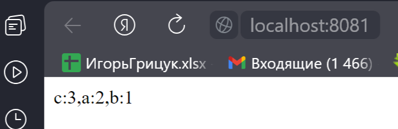

<h1>Сервис вычисление частоты встречи символов в заданной строке</h1>

## Описание
Версия программы: 0.0.1

Фрагмент работы: 

## Реализованный функционал

- вычисление частоты встречи символов в заданной строке.
- отсортирован по убыванию количества вхождений символа в строке.
- ответ об ошибках.

## Запуск 1

- Клонируем весь проект с https://github.com/igr76/characterCounter  в IntelliJ IDEA
  
- Запускаем программу
- После запуска переходим по адресу http://localhost:8081.
- Вводим строку, которую хотим проверить после адреса
  
- Получаем ответ
- Пример запроса http://localhost:8081/fggfhhdaaaaa

- Можно работать через swagger http://localhost:8081/swagger-ui/index.html

## Используемые технологии

- Java 17
- Spring Boot 3.1.5
- Liombok

## Автор проекта

- <a  href="https://github.com/igr76">Грицук Игорь</a>

